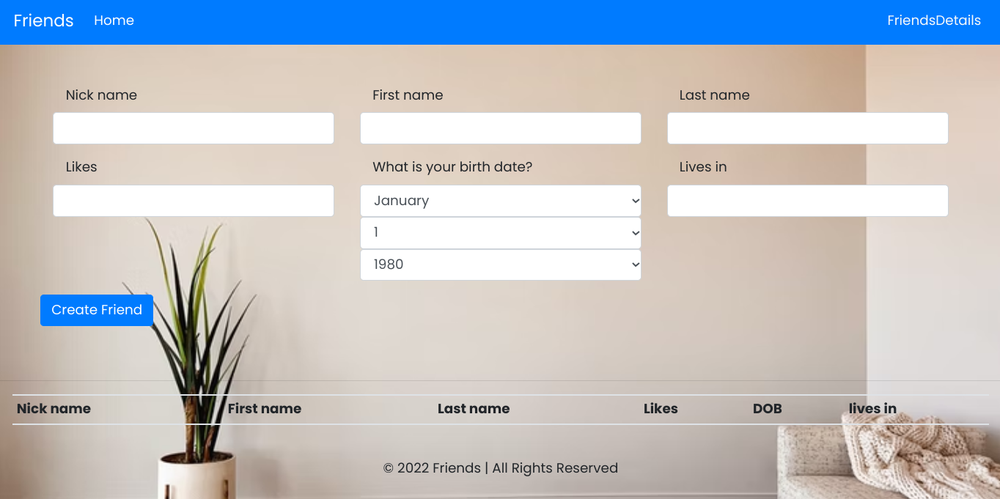

## DjangoAjax-Forms

### Description
Its a simple ajax form that allows user to enter details.

### Author
Nazarena Wambura. 
[Github Account](https://github.com/nazarena254)

### Resources
1. [Plural site](https://app.pluralsight.com/guides/work-with-ajax-django)
2. [Django AJAX csrf](https://docs.djangoproject.com/en/2.2/ref/csrf/#ajax)

### Homepage

### Setup/Installation Requirements
1. Create a folder and cd to it.
2. Clone the repository below with the command `git clone <https option url> .`   
    https://github.com/nazarena254/Awwards  
3. Install dependencies in the requirements.txt file `pip install -r requirements.txt` .
4.  Type code . or atom . based on the text editor you have and work on it.   

## Database
1. Set up Database(postgresql),and put your username and password in the code
2. Make migrations
    python3 manage.py makemigrations
3. Migrate
   python3 manage.py migrate 
       
### Running the Application
1. Run main aplication locally on http://127.0.0.1:8000/ local host     
   * python3.9 manage.py runserver 
    Note: python version will vary in future

### Creating Admins
1. Creating Admin Locally 
     python manage.py createsuperuser. Then set username, email & password

2. Creating Django Admin   
     heroku run python manage.py createsuperuser. Then set username, email & password

### Technologies Used
* Python3.9.2 - as backend language
* Django4.0.5 - as a Framework
* Bootstrap4 - for responsiveness & styling 
* PostgreSQL - as database
* Heroku - for deploying app

### Support & Contact Information
For any further inquiries, bugs, contributions or comments, reach me at: 
Email:<nancyngunjiri1@gmail.com>

### License
[MIT License](https://github.com/nazarena254/AjaxForms/blob/master/LICENSE) 
Copyright (c) 2021 **Nazarena Wambura**
